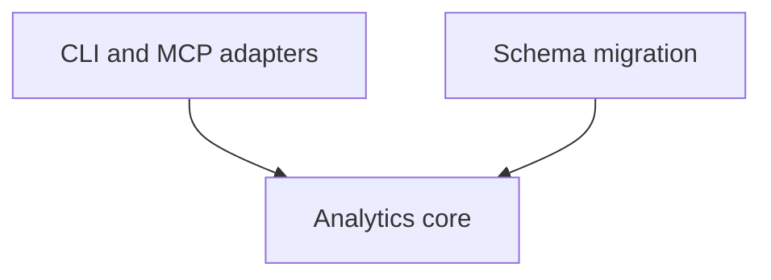

<!-- aligned-structure:v2 -->
# Feedback History Analytics

## Motivation

Provide statistical insight from historic feedback before improving the feedback schema and interfaces.

## Reading Order

1. [Analytics core](workflow-tools/feedback/crates/feedback-api/) - event, incident, and lifecycle contract.
2. [Feedback CLI](workflow-tools/feedback/crates/feedback-cli/) - report adapter.
3. [Feedback MCP](workflow-tools/feedback/crates/feedback-mcp/src/server.rs) - query adapter.

## Component Relationship Map

## Shared Invariants

Raw parseable events remain observable through current-schema analytics. Derived incidents never replace raw events. Tentative resolution requires 10 quiet days containing at least 100 valid feedback events. Analytics validation precedes schema migration. The schema migration permanently removes unmigratable legacy lines after reporting a discarded-record total and retains no legacy backup.

## Evidence

- `cargo test --manifest-path workflow-tools/Cargo.toml -p feedback-api analytics`
- `cargo test --manifest-path workflow-tools/Cargo.toml -p feedback-cli analytics`
- `cargo test --manifest-path workflow-tools/Cargo.toml -p feedback-mcp analytics`
- `cargo test --manifest-path workflow-tools/Cargo.toml -p feedback-api migration`

## Scope

This parent coordinates analytics core, transport adapters, and post-validation schema migration. It does not define cross-workspace move behavior.