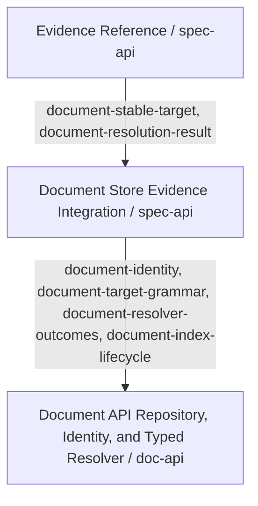

<!-- aligned-structure:v2 -->

# Document Store Evidence Integration

## Target Code Location

[workflow-tools/doc/crates/doc-api/src/evidence.rs](../../../workflow-tools/doc/crates/doc-api/src/evidence.rs) contains the current document evidence record; [workflow-tools/doc/crates/doc-api/src/workspace.rs](../../../workflow-tools/doc/crates/doc-api/src/workspace.rs) contains the deterministic workspace-discovery baseline.

## Naming Conventions

Use Document API-owned typed document target grammar and `document-` criterion
ids. This integration child owns `document-stable-target`,
`document-resolution-result`, and `document-evidence-nongating`; its provider
child owns identity, parser, repository, and resolver criteria.

## Reading Order

1. [224f9384 Document API Repository, Identity, and Typed Resolver Contract](../224f9384-c38f-4d8b-855e-a8b2457887ca/body.md) - required doc-api provider.
2. [7498bed7 Evidence Reference Contract](../7498bed7-ac74-4484-b50e-8a9cf96d8431/body.md) - document-target consumer.

## Component Relationship Map

## Responsibility

If implemented by the adjacent Document API, evidence consumers can resolve a
stable document identity and review location without using availability as
fulfillment status.

## Interfaces And Dependencies

The [224f9384 Document API Repository, Identity, and Typed Resolver Contract](../224f9384-c38f-4d8b-855e-a8b2457887ca/body.md) owns the document repository/index, identity, grammar, and typed resolver before spec evidence resolution ships. Its identity is exactly `(workspace_slug, repo_relative_path)` and its resolver returns `Resolved { record }`, `Missing { identity }`, or `Unsupported { target }`. This is a specified-but-not-built prerequisite: spec-api consumes outcomes only and introduces neither an adapter grammar nor free-form path semantics.

## Behavior

- `document-stable-target`: a document has a stable target reference.
- `document-resolution-result`: `Resolved { record }` exposes identity and review location; `Missing { id }` and `Unsupported { target }` are typed non-success outcomes.
- `document-evidence-nongating`: unavailable or unobserved material is not a mandatory-evidence health failure.

## Boundaries And Failure Cases

The document store neither decides criterion success nor manufactures a locator.
Missing documents yield `Missing { id }`, unsupported targets yield
`Unsupported { target }`, and neither outcome establishes success or changes
health policy. Before the Document API repository/index and grammar exist,
evidence-reference behavior cannot claim document resolution.

## Provider/Consumer Contract

Consumes `document-identity`, `document-target-grammar`, `document-resolver-outcomes`, and `document-index-lifecycle` from [224f9384 Document API Repository, Identity, and Typed Resolver Contract](../224f9384-c38f-4d8b-855e-a8b2457887ca/body.md); provides `document-stable-target` and `document-resolution-result` to [7498bed7 Evidence Reference Contract](../7498bed7-ac74-4484-b50e-8a9cf96d8431/body.md).

## Examples

A Document API typed target resolves to its stable identity and heading. A
missing target returns `Missing { id }`, which Evidence Reference can consume
without claiming a criterion was fulfilled.

## Evidence

Position: `not-implemented` in this repository: the Document API repository,
index, and typed resolver grammar do not exist. Validate `Resolved`, `Missing`,
and `Unsupported` in the owning Document API test suite before spec evidence
resolution is implemented.

## Scope

Defines the provider contract only; document storage implementation remains external.
